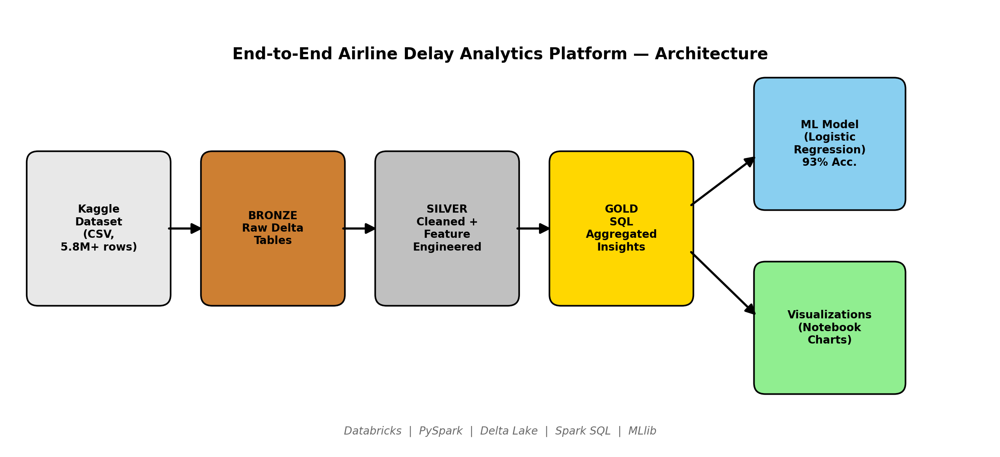
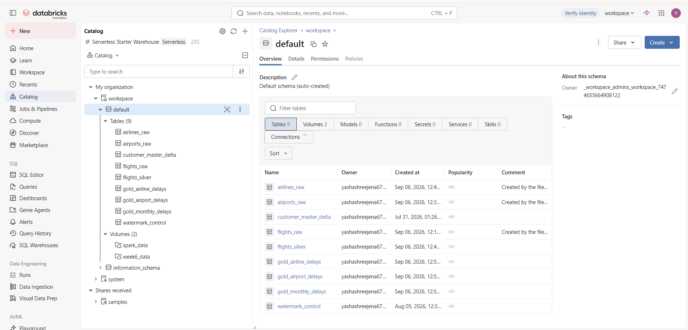
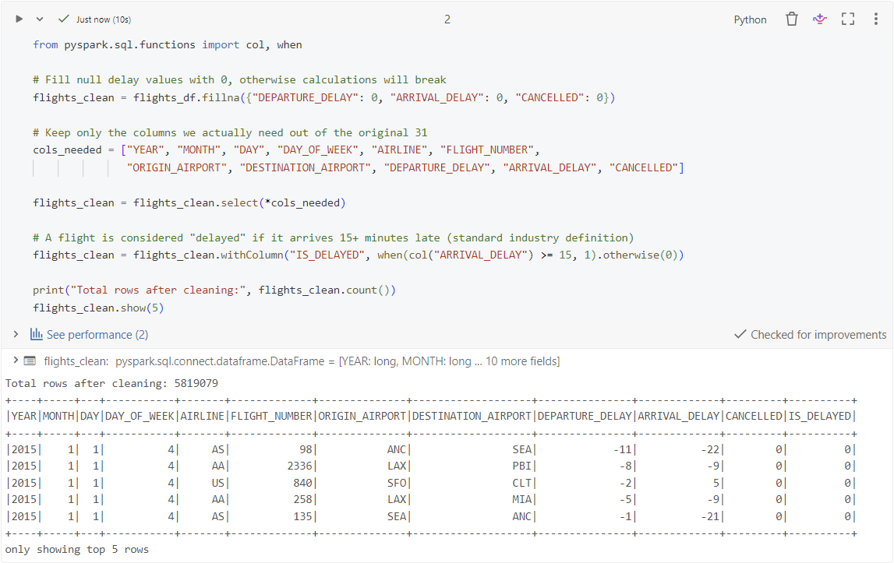
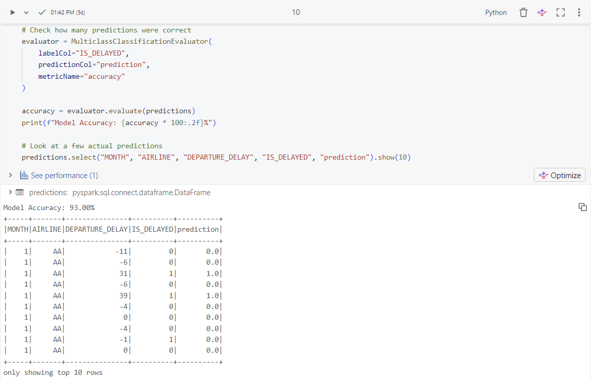

<div align="center">

# ✈️ Airline Delay Analytics Platform

### An End-to-End Databricks Lakehouse Pipeline for Flight Delay Analysis & Prediction


</div>

---

## 📖 Table of Contents

- [Overview](#-overview)
- [Architecture](#️-architecture)
- [Tech Stack](#️-tech-stack)
- [Key Insights](#-key-insights)
- [Prediction Model](#-prediction-model)
- [Screenshots](#-screenshots)
- [Project Structure](#-project-structure)
- [How to Reproduce](#-how-to-reproduce)
- [Concepts Demonstrated](#-concepts-demonstrated)
- [Future Enhancements](#-future-enhancements)
- [Author](#-author)

---

## 📌 Overview

This project analyzes **5.8M+ historical US flight records** to answer three practical questions: *which airlines and airports consistently underperform, when do delays spike seasonally, and can a flight's delay be predicted in advance?*

It was built independently as a self-directed project — post-internship — to apply core data engineering concepts (distributed processing, lakehouse design, and applied ML) to a real, large-scale dataset from ingestion through to a working prediction model.

---

## 🏗️ Architecture

This project follows the **Medallion Architecture** — a layered lakehouse design pattern used widely in production data platforms.



| Layer | Purpose | Tables | Format |
|---|---|---|---|
| 🥉 **Bronze** | Raw data exactly as ingested, no transformations | `flights_raw`, `airlines_raw`, `airports_raw` | Delta |
| 🥈 **Silver** | Cleaned, filtered to relevant columns, delay flag engineered | `flights_silver` | Delta |
| 🥇 **Gold** | Business-ready aggregates, computed via SQL | `gold_airline_delays`, `gold_airport_delays`, `gold_monthly_delays` | Delta |

---

## 🛠️ Tech Stack

| Category | Tools |
|---|---|
| Platform | Databricks (Free/Community Edition) |
| Processing | PySpark, Spark SQL |
| Storage | Delta Lake |
| Machine Learning | PySpark MLlib (Logistic Regression) |
| Visualization | Databricks native notebook charts |
| Dataset | [Kaggle — US DOT 2015 Flight Delays](https://www.kaggle.com/datasets/usdot/flight-delays) |

---

## 📊 Key Insights

**Airline Performance** — average arrival delay by carrier:

| Airline | Avg. Arrival Delay |
|---|---|
| Spirit Airlines (NK) | 🔴 +14.2 min (worst) |
| Frontier (F9) | +12.4 min |
| Alaska Airlines (AS) | 🟢 −0.97 min (best — early on average) |

**Airport Bottlenecks** — identified using a correlated SQL subquery that flags airports whose average departure delay exceeds the network-wide average.

**Seasonality** — delay percentage peaks in **June** (summer travel surge) and is lowest in **September–October**.

---

## 🤖 Prediction Model

A **Logistic Regression** classifier predicts whether a flight will be delayed 15+ minutes on arrival, using month, day of week, airline, and departure delay as input features.

```
Pipeline: StringIndexer → VectorAssembler → LogisticRegression
Test Accuracy: 93%
```

A simple, interpretable model was chosen deliberately — it establishes a strong baseline while keeping the reasoning behind each prediction transparent.

---

## 🖼️ Screenshots

**Catalog — all Bronze/Silver/Gold Delta tables**


**Silver layer — cleaned data with engineered `IS_DELAYED` flag**


**Notebook — model training and 93% accuracy evaluation**


---

## 📂 Project Structure

```
airline-delay-databricks/
│
├── README.md
│
├── notebooks/
│   └── 01_silver_cleaning.py
│
├── architecture/
│   └── architecture.png
│
└── screenshots/
    ├── bronze_tables.png
    ├── silver_table.png
    └── databricks_notebook.png
```

---

## 🚀 How to Reproduce

1. **Create a Databricks account** — [Community/Free Edition](https://community.cloud.databricks.com) (no cost)
2. **Download the dataset** — [US DOT Flight Delays on Kaggle](https://www.kaggle.com/datasets/usdot/flight-delays)
3. **Ingest the data** — via `Data Ingestion → Create or modify table`, upload `flights.csv`, `airlines.csv`, and `airports.csv` as Delta tables
4. **Run the pipeline** — open `notebooks/01_silver_cleaning.py` in Databricks and execute cells in order: Bronze read → Silver clean → Gold SQL → ML training → visualizations

---

## 💡 Concepts Demonstrated

- Medallion (Bronze/Silver/Gold) lakehouse architecture
- Delta Lake table management and versioned storage
- Spark SQL — aggregations, `GROUP BY`, and correlated subqueries
- Large-scale PySpark DataFrame transformations (5.8M+ rows)
- ML pipeline design and evaluation with PySpark MLlib
- Turning raw operational data into decision-ready insights

---

## 🔮 Future Enhancements

- [ ] Automate the pipeline with Databricks Jobs/Workflows for scheduled runs
- [ ] Benchmark against a Random Forest / Gradient Boosted Trees model
- [ ] Build a proper Databricks SQL Dashboard or Power BI report
- [ ] Add weather data as an additional predictive feature
- [ ] Migrate Silver/Gold writes to a `MERGE`-based incremental pattern

---

## 👩‍💻 Author

**Yashashree** — Final Year B.Tech, Computer Science
